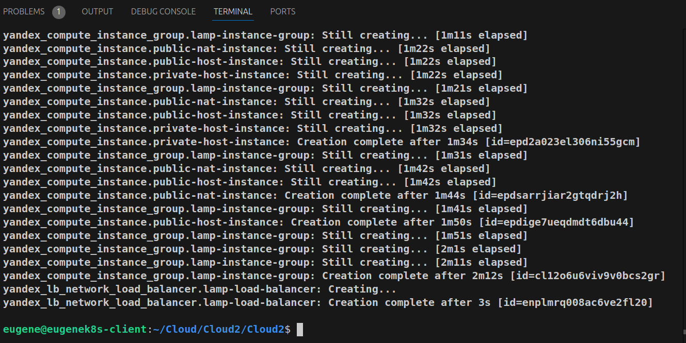
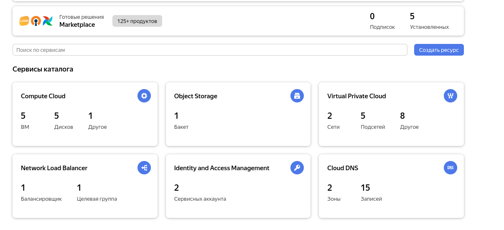
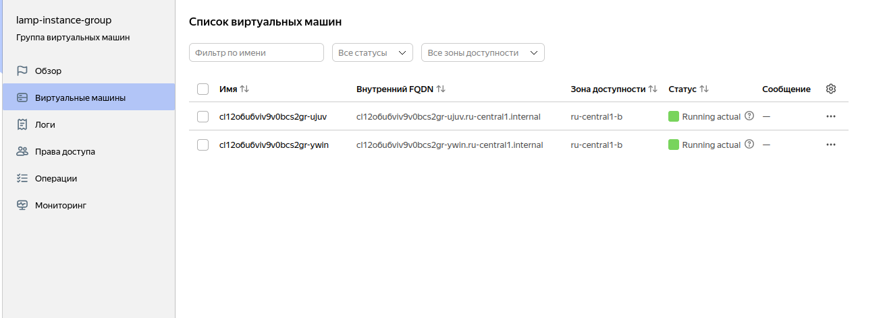
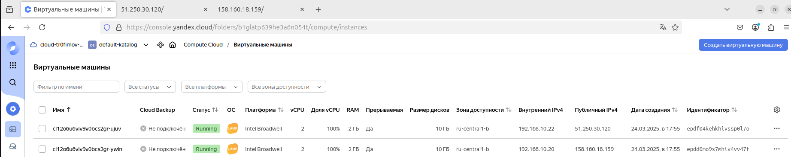
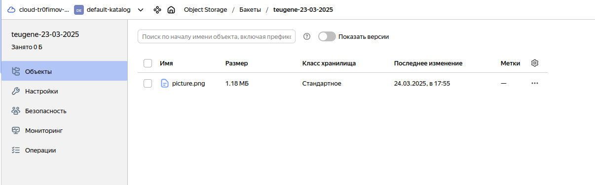
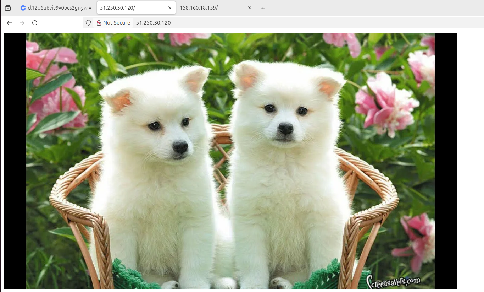
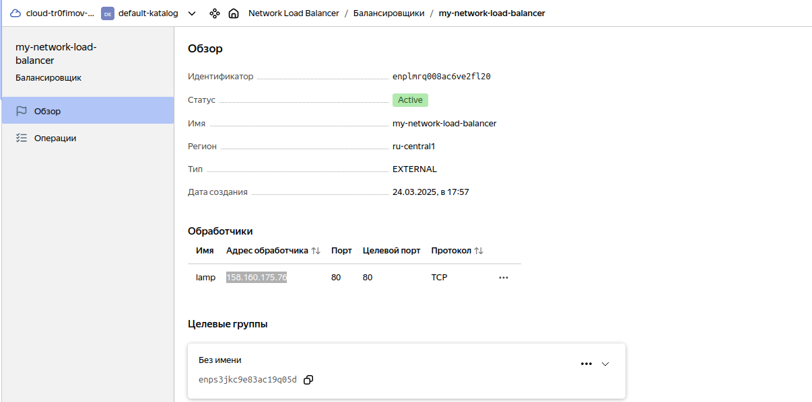
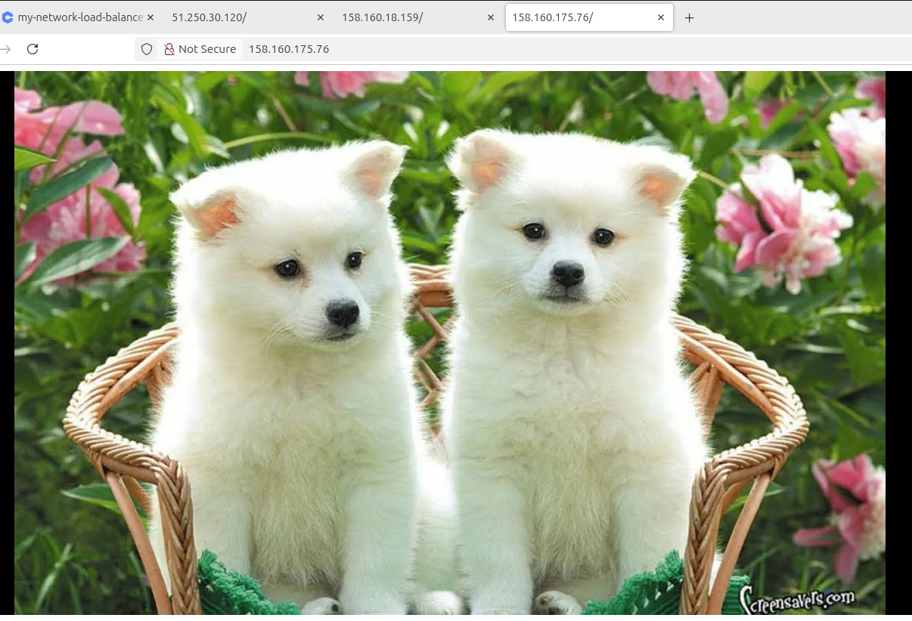
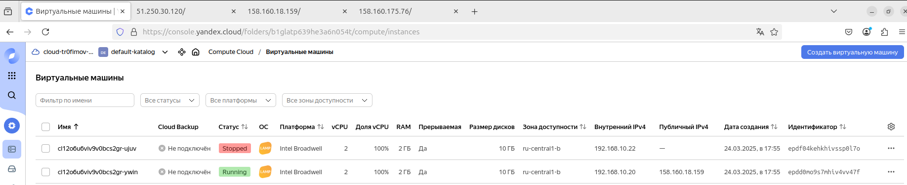
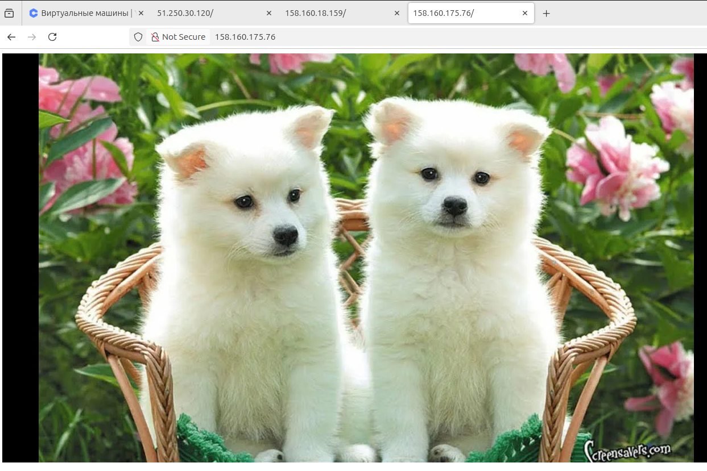

1. Конфигурационные файлы Terraform:

[Network LB](network_loadbalancer.tf)

[Object Storage](object-storage.tf)

[Service Account](sa.tf)

[Compute instance](compute-instance-group.tf)

2. Результат выполнения terraform apply:

3. Группа виртуальных машин:

4. Object Storage Bucket:

5. Фото из object storage отображается на публичном ip адресе одной из ВМ:

6. Network Load Balancer:

7. Фото из object storage отображается на публичном ip адресе Network Load Balancer:

8. Одна из ВМ выключена. Фото по прежнему доступно по ip адресу Network Load Balancer:

