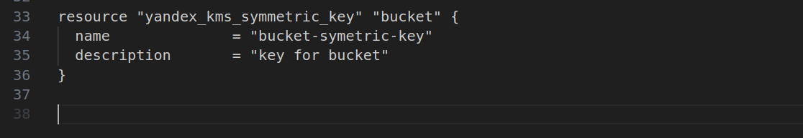
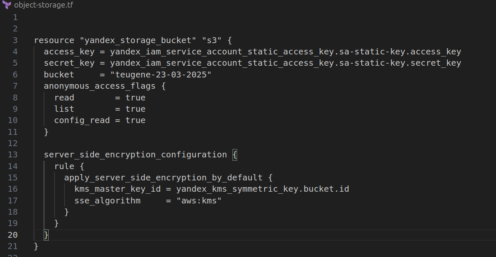
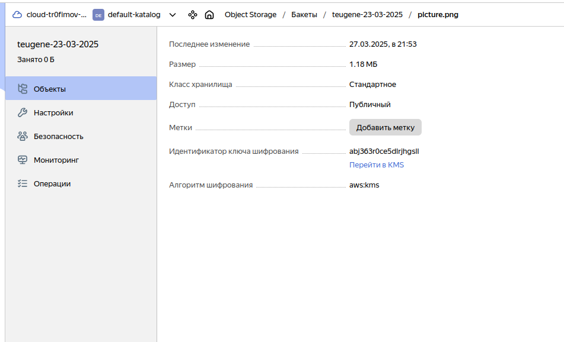
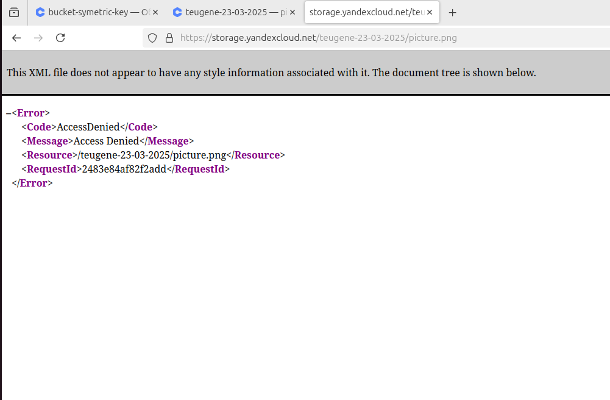

1. Конфигурационные файлы Terraform:

[Object Storage](object-storage.tf)

[Service Account](sa.tf)

[Compute instance](compute-instance-group.tf)

2. resource "yandex_kms_symmetric_key":

3. resource "yandex_storage_bucket" с блоком server_side_encryption_configuration:

4. Object Storage Bucket:

